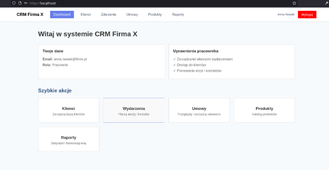

# CRM System

> Academic project created for university purposes.

CRM system for managing clients, contracts and events for sales representatives.



## Requirements
- Docker and Docker Compose

## Quick start (Docker)

1. Copy `.env.example` to `.env`:
```shell
cp .env.example .env
```

2. Start the whole system:
```shell
docker compose up -d --build
```

2a. If you run into issues, you may need to install dependencies manually.
In the main project folder run:

```shell
deno install
```

Then go to the `/frontend` folder and run:

```shell
npm install
```

3. Open your browser:
   - **Frontend**: http://localhost
   - **Backend API**: http://localhost:8080/api

## Test accounts

| Name | Role | Region | Email | Password |
|------|------|--------|-------|----------|
| Jan Kowalski | Boss | Zielona Góra | jan.kowalski@firmx.pl | password123 |
| Anna Nowak | Employee | Szczecin | anna.nowak@firmx.pl | password123 |
| Piotr Wiśniewski | Employee | Wrocław | piotr.wisniewski@firmx.pl | password123 |
| Marek Zieliński | Employee | Poznań | marek.zielinski@firmx.pl | password123 |

## Stopping the system

To stop the system:
```shell
docker compose down
```

To also remove database data:
```shell
docker compose down -v
```

## Local development

### Backend (Deno)
```shell
# Start only the database
docker compose up db -d

# Start backend in dev mode
deno task dev
```

### Frontend (SvelteKit)
```shell
cd frontend
npm install
npm run dev
```
